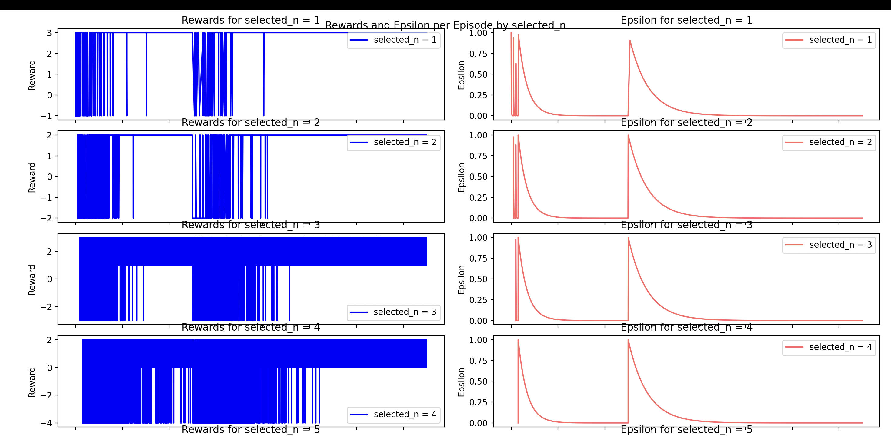
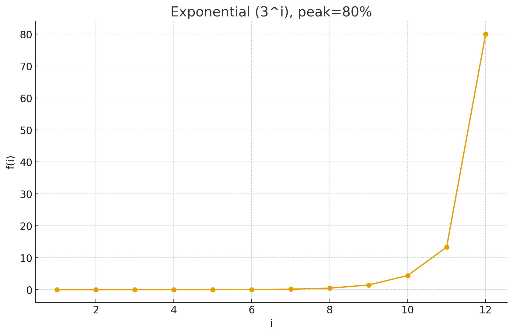

# Rubik's Cube Solver using Deep Q-Network (DQN)

A reinforcement learning project that trains a Deep Q-Network to solve a 2x2x2 Rubik's cube using PyTorch. The agent learns through curriculum learning, starting with simple scrambles and progressively tackling more complex cube configurations.

### Key Algorithm Components

**Progressive Difficulty Training**: The algorithm controls the number of random moves `n` used to scramble the cube from its solved state. As training progresses, `n` increases, making the problem more challenging and allowing the agent to build solving capabilities incrementally. The following graphs show the success rate improving over time for n = 1, 2, 3, 4 (higher blue line is better):


**DQN Framework**:

- **Environment**: Custom 2x2x2 Rubik's cube implementation
- **State Representation**: 144-dimensional flattened binary vector representing cube faces
- **Actions**: 6 discrete actions corresponding to different cube rotations
- **Reward Function**:
  - +3 for reaching the solved state (configurable)
  - -1 for each move taken (encourages efficiency)
  - Early termination if moves exceed scramble complexity

## Features

- **Modular Architecture**: Clean separation of training, testing, and environment logic
- **Custom Rubik's Cube Environment**: Optimized 2x2x2 cube with 6 rotation actions
- **Deep Q-Network**: 144x256x10 model architecture for Q-value approximation
- **Experience Replay**: Deque-based memory buffer for stable learning
- **Target Network**: Separate target network updated periodically for stability
- **Adaptive Curriculum**: Progressive difficulty with weighted scramble selection
- **Visualization**: Training results are plotted (reward, epsilon, selected_n, episodes)
- **Model Checkpointing**: Automatic saving of trained models
- **Comprehensive Testing**: Evaluation framework with success rate metrics

## Project Structure

```
rubiks-cube-solver-rl/
├── main.py                           # Main training and testing pipeline
├── dqn.py                           # DQN implementation and training logic
├── env.py                           # Rubik's cube environment
├── test.py                          # Model evaluation and testing functions
├── requirements.txt                 # Python dependencies
└── README.md                        # Project documentation
```

## Installation

1. **Clone the repository:**

```bash
git clone https://github.com/douglasichen/rubiks-cube-solver-rl.git
cd rubiks-cube-solver-rl
```

2. **Create a virtual environment (recommended):**

```bash
python -m venv local.venv
source local.venv/bin/activate  # On Windows: local.venv\Scripts\activate
```

3. **Install dependencies:**

```bash
pip install -r requirements.txt
```

## Usage

### Quick Start - Training

Run the complete training and evaluation pipeline:

```bash
python main.py
```

This will:

- Train a DQN agent using curriculum learning (1-5 scramble moves)
- Train for 150,000 episodes with progress visualization
- Display rewards within a graph and logs success rates


### Quick Start - Testing

Run the testing script on the pretrained model:

```bash
python test.py
```

### Custom Training

You can customize training parameters by modifying `main.py`:

```python
policy = train(
    gamma=0.99,                                    # Discount factor
    learning_rate=0.00001,                        # Learning rate
    batch_size=256,                               # Training batch size
    target_update_freq=1500,                      # Target network update frequency
    memory_size=15000,                            # Experience replay buffer size
    reward_for_solving=3,                         # Reward for solving the cube
    save_model=True,                              # Save model checkpoints
    n_points=[0, 1000, 2000, 3000, 50_000, 150_000],  # Training phase breakpoints
    create_graph=True,                            # Generate training plots
)
```

## Environment Details

### State Representation

- **State Space**: 144-dimensional flattened vector representing the cube configuration
- **Binary Encoding**: Each cube face is represented using only 1s and 0s to help the network quickly understand the relevance of different cube colors
- **Action Space**: 6 discrete actions corresponding to different cube rotations
- **Reward Structure**:
  - +3 for solving the cube (encourages success)
  - -1 for each move taken (encourages solving with fewer moves)

### Actions

The cube supports 6 rotation actions corresponding to different face rotations. The specific mapping depends on the cube's internal representation in `env.py`.

## Model Architecture

### DQN Network

```python
class DQN(nn.Module):
    def __init__(self, input_dim=144, output_dim=6):
        self.fc1 = nn.Linear(144, 256)    # Input layer
        self.fc2 = nn.Linear(256, 256)    # Hidden layer 1
        self.fc3 = nn.Linear(256, 6)      # Output layer (Q-values)
```


## Training Strategy

### Curriculum Learning Phases

The training uses weighted selection within progressive difficulty phases:

1. **Phase 1** (0-1,000 episodes): 1-move scrambles
2. **Phase 2** (1,000-2,000 episodes): 1-2 move scrambles
3. **Phase 3** (2,000-3,000 episodes): 1-3 move scrambles
4. **Phase 4** (3,000-50,000 episodes): 1-4 move scrambles
5. **Phase 5** (50,000-150,000 episodes): 1-5 move scrambles

### Adaptive Difficulty Selection

Within each phase, the system uses `select_n_2()` function with exponential weighting that favors higher complexity scrambles while maintaining some probability for easier cases.

For example, n = 12 with a peak of 80% produces the following weights plotted on this graph: 

### Epsilon-Greedy Exploration

- **Decay Function**: `epsilon = k^(2x/n)` where k=0.002
- **Minimum Epsilon**: 0.00001
- **Phase-based**: Resets for each curriculum phase

## Results and Visualization

Training generates comprehensive visualizations:

- **Reward Progression**: Episode rewards by scramble complexity
- **Epsilon Decay**: Exploration rate over time
- **Success Metrics**: Performance evaluation across difficulty levels

Example training results are stored in the `results/` directory.

## Dependencies

Core requirements:

- **PyTorch 2.8.0**: Deep learning framework
- **NumPy 2.0.2**: Numerical computations
- **Matplotlib 3.9.4**: Visualization and plotting
- **tqdm 4.67.1**: Progress bars

See `requirements.txt` for complete dependency list with specific versions.

## Troubleshooting

### Common Issues

1. **CUDA/GPU Issues**: The code uses CPU by default. To use GPU, modify the tensor creation:
   ```python
   state = torch.FloatTensor(state).unsqueeze(0).cuda()
   ```

2. **Memory Issues**: Reduce batch size or memory size if running out of RAM:
   ```python
   initial_batch_size = 128
   initial_memory_size = 10000
   ```

3. **Training Too Slow**: Reduce the number of episodes or simplify the network architecture.

## Future Improvements

- [ ] Add GPU support for faster training
- [ ] Add curriculum learning with more sophisticated difficulty progression
- [ ] Implement 3x3x3 cube support
- [ ] Add visualization of cube solving process
